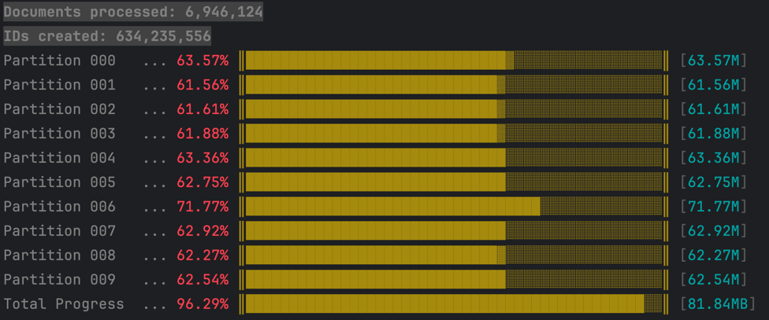

# Simulate ID Partitioning with Postgres

This simulates which partitions would be used in Postgres
to determine if there are any hotspots (partitions that are 
used more frequently that others).

This takes a CSV with two columns:

- Document ID: An unsigned 32-bit integer that represents the
  partition key.
- Count: The number of records to put in the partition for
  the Document ID.

## Build

```bash
go build -o idsim
```

## Run Example

```bash
./idsim -file documents.csv -partitions 10 -max 100000000
```

The output shows each partition, the percentage of usage, and the
maximum used ID. Hotspot partitions will have more usage (longer bars).



## Command Line Parameters

```bash
 ./idsim -help                                                          
Usage of ./idsim:
  -file string
        CSV file to process
  -iterations int
        Number of times to process the CSV file (default 1)
  -max int
        Maximum value for each partition (default 9223372036854775807)
  -min int
        Minimum value for each partition (default 1)
  -outlier int
        Outlier threshold for document count. Documents with more than this count are logged and skipped. (default 9223372036854775807)
  -partitions int
        Number of partitions (default 1)
```